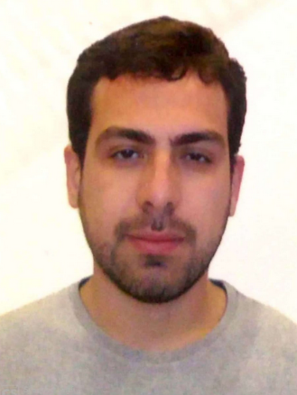

{style="float:left; padding-right:20px; max-width:20%; height:auto;"}

Hello! I'm Felipe Meneguitti Dias, a data scientist and researcher from Brazil

I am dedicated to advancing deep learning models for eletrocardiogram classification, aimed at improving diagnostic precision in the healthcare sector. I am currently pursuing a Ph.D. in Electrical Engineering at the University of Sao Paulo, where my research focuses on the innovative application of deep learning methods to biomedical signal analysis.

📧 [f.meneguittidias@gmail.com](mailto:f.meneguittidias@gmail.com)  
🔗 LinkedIn: [felipe-meneguitti-dias-312570b3](https://www.linkedin.com/in/felipe-meneguitti-dias-312570b3/?locale=en_US)  
🎓 Google Scholar: [QYW9cngAAAAJ](https://scholar.google.com.br/citations?user=QYW9cngAAAAJ&hl=en)