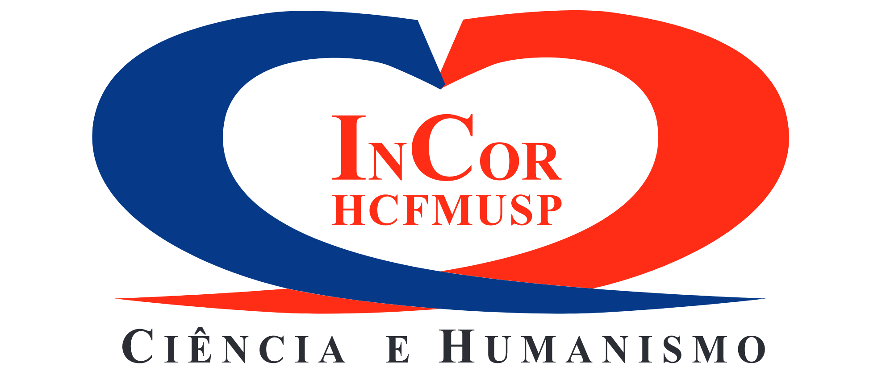

```{=html}
<div style="display:flex; align-items:center; gap:32px; margin-top:20px;">

  <div style="text-align:center;">
    
    <div style="margin-top:10px; font-size:1.2rem; font-weight:600;">
      Felipe Dias
    </div>
  </div>

  <div style="display:flex; flex-direction:column; justify-content:center;">

    <div style="margin-bottom:10px;">

      <a href="mailto:f.meneguittidias@gmail.com" target="_blank" title="E-mail">
        
      </a>

      <a href="https://www.linkedin.com/in/felipe-meneguitti-dias-312570b3/?locale=en_US"
         target="_blank" title="LinkedIn">
        
      </a>

      <a href="https://scholar.google.com/citations?user=Xr5khtoAAAAJ&hl"
         target="_blank" title="Google Scholar">
        
      </a>

      <a href="https://orcid.org/0000-0001-7778-4606"
         target="_blank" title="ORCID">
        
      </a>

      <a href="https://github.com/fmenegui"
         target="_blank" title="GitHub">
        
      </a>

      <a href="/cv/cv.qmd" target="_blank" title="CV">
        
      </a>

      <a href="http://lattes.cnpq.br/3455258218368949"
         target="_blank" title="Lattes CNPq">
        
      </a>

    </div>

    <p style="font-size:1.1rem; font-style:italic; margin:0;">
      "Researcher focused in deep learning methods for biomedical signals."
    </p>

  </div>
</div>
```


```{=html}
<style>
.timeline-wrapper {
  margin-top: 40px;
}

.timeline-line {
  width: 100%;
  height: 3px;
  background: #dcdcdc;
  position: relative;
  margin-bottom: 40px;
}

.timeline-dot {
  width: 16px;
  height: 16px;
  background: white;
  border: 3px solid #555;
  border-radius: 50%;
  position: absolute;
  top: -7px;
}

.timeline-container {
  display: flex;
  gap: 55px;
  justify-content: center;
  padding-bottom: 20px;
}

.timeline-item {
  text-align: center;
  width: 190px;
  background: white;
  border-radius: 18px;
  padding: 18px 12px;
  box-shadow: 0 3px 10px rgba(0,0,0,0.10);
}

.timeline-year {
  font-size: 0.95rem;
  font-weight: 600;
  color: #555;
  margin-bottom: 10px;
}

.timeline-logo {
  width: 70px;
  height: 70px;
  object-fit: contain;
  margin-bottom: 10px;
}

.timeline-title {
  font-size: 1.05rem;
  font-weight: 700;
  margin-top: 4px;
}

.timeline-sub {
  font-size: 0.9rem;
  color: #777;
  margin-top: 4px;
}
</style>
<br>
<br>
<br>
<div class="timeline-container">

<div class="timeline-item">
<div class="timeline-year">2012 to 2017</div>

<div class="timeline-title">Electronics Engineering</div>
<div class="timeline-sub">UFJF</div>
</div>

<div class="timeline-item">
<div class="timeline-year">2015 to 2016</div>

<div class="timeline-title">Exchange Program</div>
<div class="timeline-sub">IIT Chicago · USA</div>
</div>

<div class="timeline-item">
<div class="timeline-year">2018 to 2020</div>

<div class="timeline-title">MSc Computer Vision</div>
<div class="timeline-sub">UFJF</div>
</div>

<div class="timeline-item">
<div class="timeline-year">2020-Present</div>

<div class="timeline-title">R&D Engineer</div>
<div class="timeline-sub">InCor · HCFMUSP</div>
</div>

<div class="timeline-item">
<div class="timeline-year">2021 to 2025</div>

<div class="timeline-title">PhD Deep Learning</div>
<div class="timeline-sub">USP</div>
</div>

</div>
```
